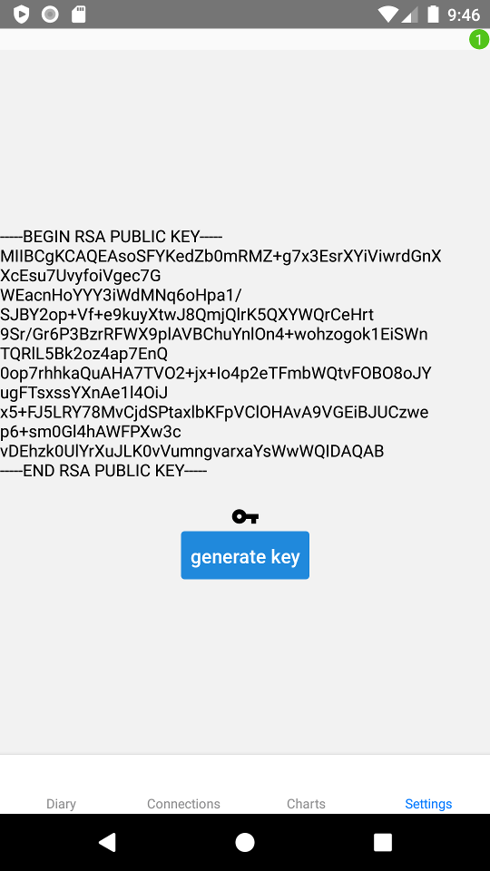
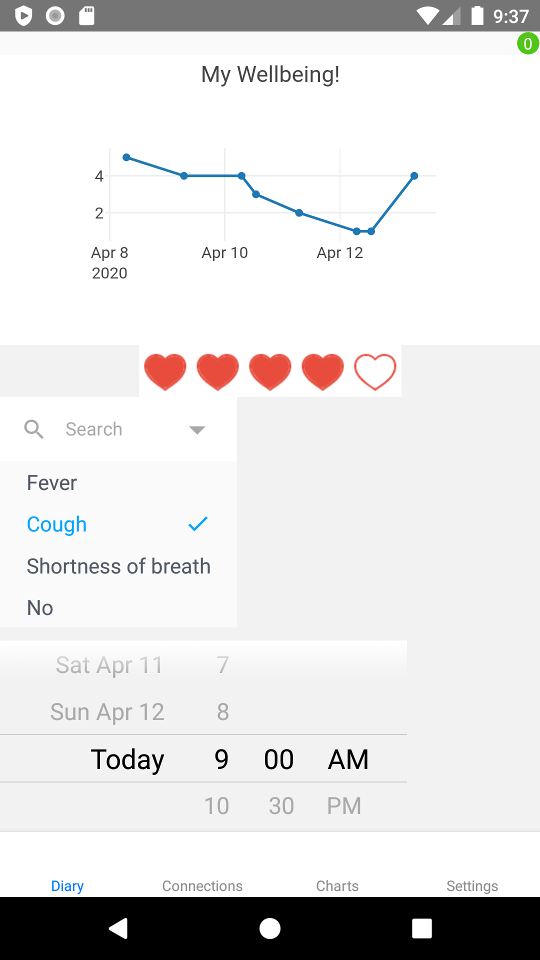
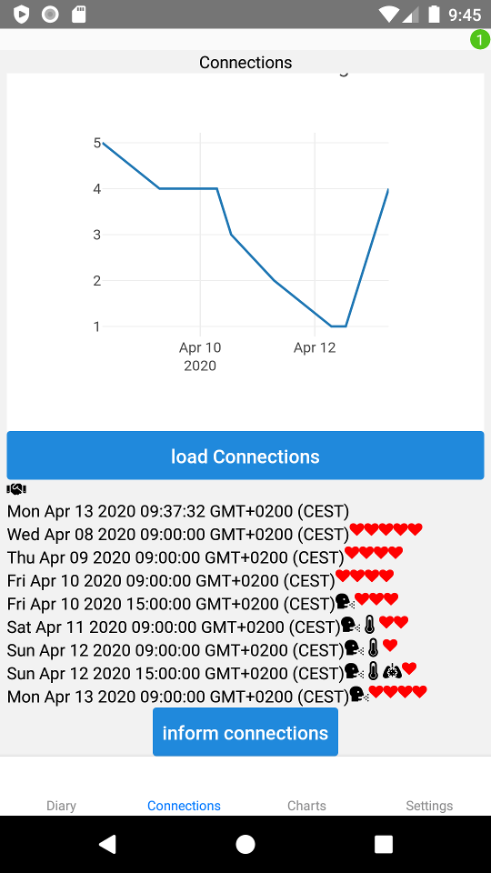

# Corona Diary App

App to log welbeing and symptoms.
Share symptoms with persons you had contact.
View welbeing of persons you had contact with.

## Public Key

Generate random public keys.
The public keys will be shared automatically to
physical nearby persons.

## Diary

Log your welbeing in a diary.
General welbeing and symptoms can be logged.
Diary entries can be visualized in a graph.

## Connections

Send your diary entries anonym to persons you received their public key before.

Download diary entries of persons who anonym shared their diary entries with you.

You can see the time you exchanged public key pairs and what kind of symptoms they had.

